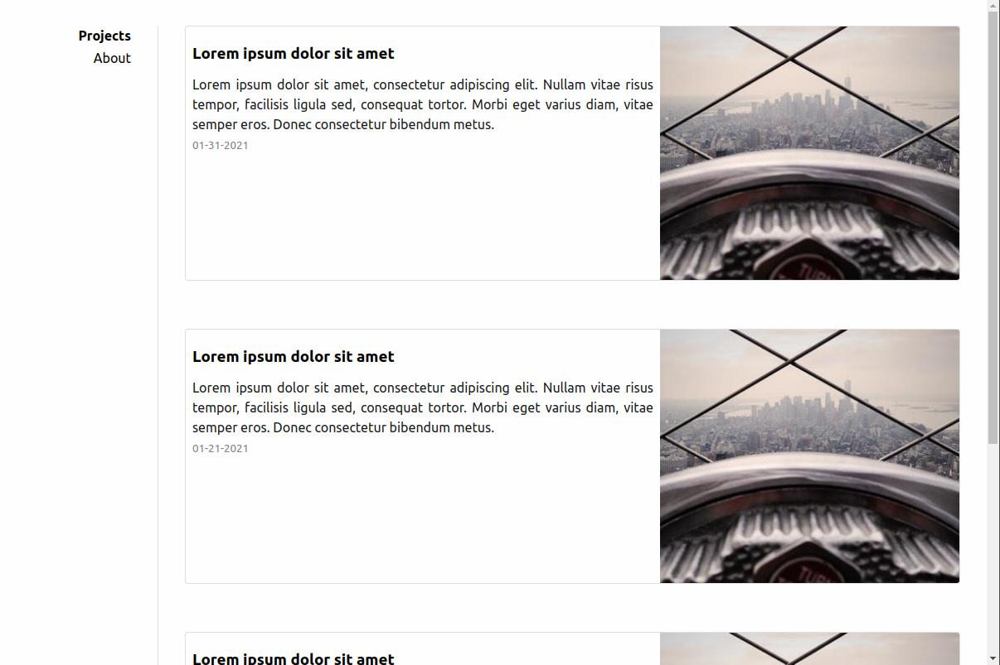
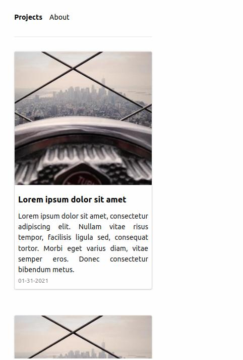

# SideyCards

SideyCards is a very simple jekyll theme based on [Sidey](https://github.com/ronv/sidey). Template for my personal webpage.

Main difference to Sidey is the introduction of Cards for the post previews. Addtionally SEO optimizations are removed and Robots.txt is configured *against* search engine scraping.

### Features

- Responsive design
- Inline CSS
- Anchor headings
- Tags & tag pages
- Security headers (for Netlify hosting)
- Gitlab CI script
- 404 page
- Compressed CSS and HTML
- Robots.txt (Configured to disallow everything)
- Sass
- Sidebar navigation

### Screenshots
#### Desktop

#### Mobile

