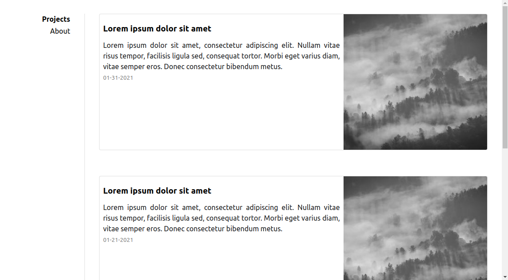

# SideyCards

Jekyll template for my private website.

SideyCards is a very simple jekyll website theme based on the (Sidey)[https://github.com/ronv/sidey] theme.

Main difference to the original Sidey is the introduction of Cards for the post preview. Addtionally SEO ptimizations and Robots.txt is configured *against* search engine scraping.

### Features

- Responsive design
- Inline CSS
- Anchor headings
- Tags & tag pages
- Security headers (for Netlify hosting)
- Gitlab CI script
- 404 page
- Compressed CSS and HTML
- Robots.txt (Configured to disallow everything)
- Sass
- Sidebar navigation

### Screenshot

